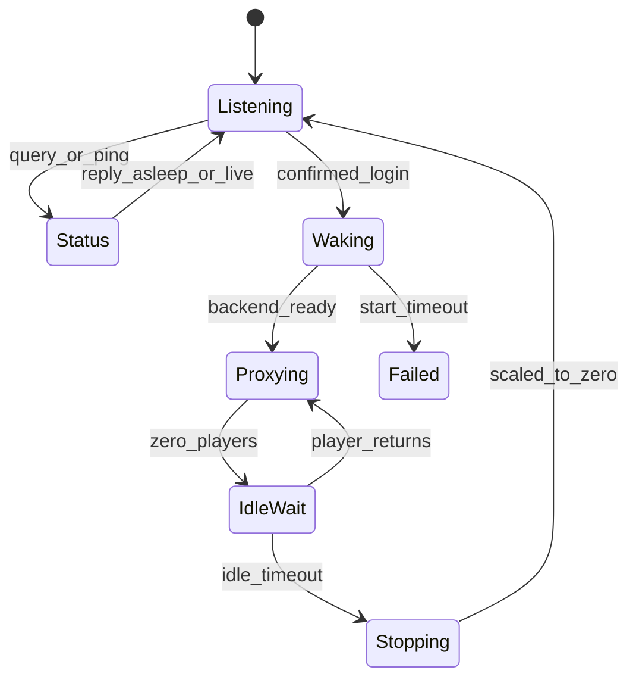

# ADR-0003: Edge gateway first

## Status

Accepted

## Date

2026-10-03

## Context

Idle shutdown and wake-on-connect are the reason this project exists. Pterodactyl-style panels start and stop servers from a UI. They do not sit on the player path.

If the middleware lives in the game pod, it disappears when the world scales to zero, and nothing is left to hear a login. The middleware must be a separate always-on process with a stable public endpoint.

Minecraft Java already has production-quality proxies that do this ([lazymc](https://github.com/timvisee/lazymc), [itzg/mc-router](https://github.com/itzg/mc-router)). Valheim and Palworld do not. A generic L4 forwarder that wakes on the first packet will start servers for scanners and Steam queries.

## Decision

1. **The edge gateway is the v1 centerpiece.** The control plane exists to configure worlds, expose settings, and reconcile Kubernetes. The gateway owns wake, proxy, idle, and player-activity signals.
2. **The gateway is an always-on Fargate Deployment** behind a Network Load Balancer. Game pods are backends, never the public listener.
3. **Game support is an adapter interface**, not a single packet pump. An adapter can:
   - distinguish a status/query from a login
   - decide whether to wake
   - hold, kick, or tell the client to retry while the backend boots
   - report player activity for the idle timer
   - request a graceful stop
4. **v1 ships the Minecraft Java adapter.** Valheim and Palworld adapters are specified now and built later. UDP wake is "start the world and expect a retry," not "hold the datagram stream."
5. **Reuse `mc-router` behavior for Minecraft Java** (hostname routing, asleep MOTD, StatefulSet `0/1` scale). Do not write a Java protocol proxy from scratch. A custom multi-game gateway process may embed that behavior or call it; it must still own the adapter interface for later UDP titles.
6. **Wake only on a confirmed login or game handshake**, never on the first raw packet. Status pings may return an "asleep" or "starting" message without scaling up, unless a given adapter documents an exception.
7. **Idle timeout is a per-server setting.** The gateway starts the stop timer when the adapter reports zero players, cancels it when a player is present, and will not use a default shorter than a flaky disconnect window (minutes, not seconds).

## Connection lifecycle

## Consequences

- The gateway is always billed. That is the price of wake-on-connect.
- False-wake rules belong in each adapter spec. A shared L4 "any traffic wakes" mode is not allowed for UDP.
- Minecraft can multiplex many worlds on one TCP listener via handshake hostname. UDP worlds cannot; they need a port or address per world ([ADR-0004](ADR-0004-persistence-and-networking.md)).
- The control plane must not stop a world out from under the gateway. Scale-down is the gateway's job, or the control plane asks the gateway to drain.
- Implementation details live in [docs/specs/edge-gateway.md](../specs/edge-gateway.md) and [docs/specs/game-adapters.md](../specs/game-adapters.md).
