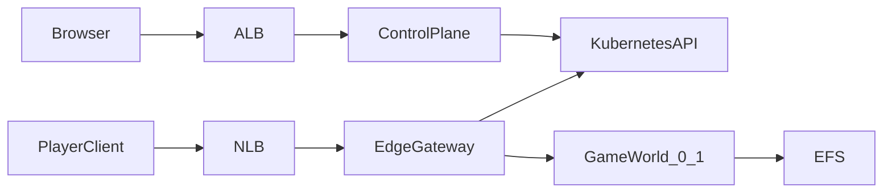

# System overview

## Purpose

Bradfordly Games is a serverless control plane for dedicated game servers. Operators log into `games.bradfordly.com` to create worlds, set an idle timeout, and see whether a world is asleep, starting, or online. Players connect to a stable hostname or port. An always-on edge gateway starts the world on a confirmed login, proxies traffic, and scales the world to zero after the idle timeout.

This document is the map. Detailed behavior lives in:

- [edge-gateway.md](edge-gateway.md)
- [control-plane.md](control-plane.md)
- [game-adapters.md](game-adapters.md)
- [operations.md](operations.md)

Decisions that this spec implements:

- [ADR-0001](../ADRs/ADR-0001-prior-art-and-viability.md) through [ADR-0005](../ADRs/ADR-0005-identity-for-games-bradfordly.md)

## Goals

- Run the panel, the gateway, and each game world on EKS Fargate.
- Shut a world down after a configurable idle period with no players.
- Start a stopped world when a player tries to log in, without opening the panel.
- Require a login to view the panel.
- Support Minecraft Java as the first adapter. Specify Valheim and Palworld as follow-on adapters.

## Non-goals (v1)

- Public multi-tenant hosting, billing, or per-world RBAC.
- Deploying Pterodactyl, Pelican, or Wings.
- Agones fleets, matchmaking, or more than one replica per world.
- Holding UDP clients across a cold start.
- A full Pelican-style file manager, SFTP, or in-browser console (may come later).
- Minecraft Bedrock, unless a later adapter spec is added.
- Switching the orchestrator to ECS.

## Components

| Component | Runtime | Role |
| --- | --- | --- |
| Control plane | Fargate Deployment | Authenticated UI and API at `games.bradfordly.com`. Stores world settings. Reconciles Kubernetes objects. |
| Edge gateway | Fargate Deployment | Public player listener. Adapters, wake, proxy, idle timer, scale `0/1`. |
| Game world | Fargate `0/1` workload | One dedicated-server container plus optional helper. ClusterIP only. |
| EFS | AWS | World saves. One access point or directory per world. |
| ALB | AWS | HTTPS to the panel. |
| NLB | AWS | TCP/UDP to the gateway. Stable allocations. |

## Data flow

### Operator

1. Browser hits `https://games.bradfordly.com`.
2. Unauthenticated users are sent through OIDC. The allowlist must contain their subject or email.
3. The panel lists worlds and their state (`asleep`, `starting`, `online`, `stopping`, `failed`).
4. Creating a world writes a record, an EFS binding, a Service, a `replicas: 0` workload, and an allocation (hostname and/or port).
5. Manual start/stop is allowed. Stop still goes through the gateway drain path so the process can flush saves.

### Player (Minecraft Java)

1. Client opens TCP 25565 on the NLB, handshake hostname `survival.games.bradfordly.com`.
2. Status intent: gateway answers MOTD (`asleep` / `starting` / live backend). No scale-up.
3. Login intent: gateway scales the StatefulSet to 1 if needed, holds or kicks per adapter settings, then proxies.
4. When the adapter reports zero players for `idle_timeout`, the gateway graceful-stops and scales to 0.

### Player (Valheim / Palworld, later)

1. Client sends UDP to that world's allocated NLB port.
2. Gateway does not wake on the first datagram. It wakes on a confirmed game handshake as defined by the adapter.
3. If the world is down, the gateway starts it. The client times out. The player retries after the panel or MOTD-equivalent says the world is up.
4. Idle uses the adapter's player-count signal, then the same graceful stop.

## Domain names

| Name | Purpose |
| --- | --- |
| `games.bradfordly.com` | Panel. HTTPS only. |
| `*.games.bradfordly.com` (Minecraft hostnames) | Handshake routing to a world. CNAME to the NLB. |
| Per-world UDP `host:port` | Shown in the panel. Points at the same NLB, dedicated listener. |

Exact hostnames are chosen when a world is created. They do not change when a pod is replaced.

## Configuration defaults

These are the defaults from the approved design. Change them only with a new ADR.

| Topic | Default |
| --- | --- |
| First adapter | Minecraft Java |
| Later adapters | Valheim, Palworld (specified, not built in v1) |
| Panel access | OIDC + allowlist, invite-only |
| Orchestrator | EKS Fargate |
| Minecraft proxy | `mc-router` behavior (hostname, MOTD, `0/1` scale) |
| Idle timeout | Per world; default minutes, not seconds |
| Replicas per world | 0 or 1 |

## Open questions

These are not blockers for documentation. Resolve them in implementation issues after the design is split into tasks.

- GitHub versus Google as the first OIDC issuer.
- Whether the Minecraft adapter embeds `mc-router` or runs it as a sidecar/process and wraps UDP later in a sibling process.
- Whether a world workload is a StatefulSet (needed for `mc-router`'s scaler) or a Deployment with an equivalent scale API.
- How EFS access points are provisioned: manual for the first worlds, or a control-plane call to AWS.

## Version

This design is the `v0.1` minor milestone. @Bradfordly creates and assigns that milestone.
