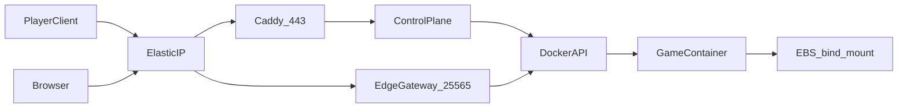

# System overview

## Purpose

Bradfordly Games is an invite-only control plane for dedicated game servers. Operators log into `games.bradfordly.com` to create worlds, set an idle timeout, and see whether a world is asleep, starting, or online. Players connect to a stable hostname or port. An always-on edge gateway starts the world on a confirmed login, proxies traffic, and stops the container after the idle timeout.

This document is the map. Detailed behavior lives in:

- [edge-gateway.md](edge-gateway.md)
- [control-plane.md](control-plane.md)
- [game-adapters.md](game-adapters.md)
- [operations.md](operations.md)

Decisions that this spec implements:

- [ADR-0001](../ADRs/ADR-0001-prior-art-and-viability.md), [ADR-0003](../ADRs/ADR-0003-edge-gateway-first.md), [ADR-0005](../ADRs/ADR-0005-identity-for-games-bradfordly.md), [ADR-0006](../ADRs/ADR-0006-pack-on-public-ec2.md)
- [ADR-0002](../ADRs/ADR-0002-reject-wings-use-eks-fargate.md) and [ADR-0004](../ADRs/ADR-0004-persistence-and-networking.md) are superseded for runtime, persistence, and ingress.

## Goals

- Run the panel, the gateway, and each game world on **one public EC2 host**.
- Shut a world container down after a configurable idle period with no players.
- Start a stopped world when a player tries to log in, without opening the panel.
- Require a login to view the panel.
- Support Minecraft Java as the first adapter. Specify Valheim and Palworld as follow-on adapters.

## Non-goals (v1)

- Public multi-tenant hosting, billing, or per-world RBAC.
- Per-world compute isolation (no EKS, no ECS Fargate).
- Deploying Pterodactyl, Pelican, or Wings.
- Agones fleets, matchmaking, or more than one replica per world.
- Holding UDP clients across a cold start.
- A full Pelican-style file manager, SFTP, or in-browser console (may come later).
- Minecraft Bedrock, unless a later adapter spec is added.
- Stopping the EC2 instance when every world is asleep.

## Components

| Component | Runtime | Role |
| --- | --- | --- |
| Control plane | Process or container on the EC2 host | Authenticated UI and API at `games.bradfordly.com`. Stores world settings. Creates and updates game containers. |
| Edge gateway | Process or container on the same host | Public player listener. Adapters, wake, proxy, idle timer, `docker start` / `docker stop`. |
| Game world | Docker container, stopped when idle | One dedicated-server image. Bind-mounted save directory. |
| Caddy | Same host | HTTPS for the panel. Let's Encrypt. |
| EBS | AWS | Root (and optional data) volume. World saves. |
| Elastic IP | AWS | Stable public address for panel and games. |

## Data flow

### Operator

1. Browser hits `https://games.bradfordly.com` (Caddy on the Elastic IP).
2. Unauthenticated users are sent through OIDC. The allowlist must contain their subject or email.
3. The panel lists worlds and their state (`asleep`, `starting`, `online`, `idle_wait`, `stopping`, `failed`).
4. Creating a world writes a record, a bind-mount directory, a stopped container, and an allocation (hostname and/or port).
5. Manual start/stop is allowed. Stop still goes through the gateway drain path so the process can flush saves.

### Player (Minecraft Java)

1. Client opens TCP 25565 on the Elastic IP, handshake hostname `survival.games.bradfordly.com`.
2. Status intent: gateway answers MOTD (`asleep` / `starting` / live backend). No container start.
3. Login intent: gateway `docker start`s the world if needed, holds or kicks per adapter settings, then proxies.
4. When the adapter reports zero players for `idle_timeout`, the gateway graceful-stops the container.

### Player (Valheim / Palworld, later)

1. Client sends UDP to that world's allocated host port on the same Elastic IP.
2. Gateway does not wake on the first datagram. It wakes on a confirmed game handshake as defined by the adapter.
3. If the world is down, the gateway starts it. The client times out. The player retries after the panel or MOTD-equivalent says the world is up.
4. Idle uses the adapter's player-count signal, then the same graceful stop.
5. These titles need a larger instance than `t3.medium`. Resize first.

## Domain names

| Name | Purpose |
| --- | --- |
| `games.bradfordly.com` | Panel. HTTPS only. A / ALIAS to the Elastic IP. |
| `*.games.bradfordly.com` (Minecraft hostnames) | Handshake routing to a world. Same IP. |
| Per-world UDP `host:port` | Shown in the panel. Same IP, dedicated host port. |

Exact hostnames are chosen when a world is created. They do not change when a container is replaced.

## Configuration defaults

These are the defaults from the approved design. Change them only with a new ADR.

| Topic | Default |
| --- | --- |
| First adapter | Minecraft Java |
| Later adapters | Valheim, Palworld (specified, not built in v1) |
| Panel access | GitHub OIDC + SSM allowlist, invite-only |
| Orchestrator | One public EC2 (`t3.medium` for v1) + Docker |
| Panel and gateway | Docker containers on the host daemon |
| World records | SQLite on the 50 GB data volume |
| Minecraft proxy | `mc-router` Docker mode |
| Idle timeout | Per world; default minutes, not seconds |
| Containers per world | 0 running or 1 running |
| Worlds running at once | One (v1 assumption) |

## Cost comparison

Full tables: [ADR-0006](../ADRs/ADR-0006-pack-on-public-ec2.md) and [operations.md](operations.md).

| Host | Monthly, worlds asleep | Notes |
| --- | --- | --- |
| **G `t3.medium` (chosen)** | **~$38** | Minecraft v1. Idle does not lower this. |
| D-min ECS Fargate | ~$53 | Isolation we are not buying. |
| G `t3.large` | ~$68 | Needed before Valheim/Palworld. Then D-min is cheaper. |
| A EKS Fargate | ~$182 | Rejected. |

us-east-1 On-Demand list prices, October 2026 snapshot. Budget model, not a quote.

## Version

This design is the `v0.1` minor milestone. @Bradfordly creates and assigns that milestone.
